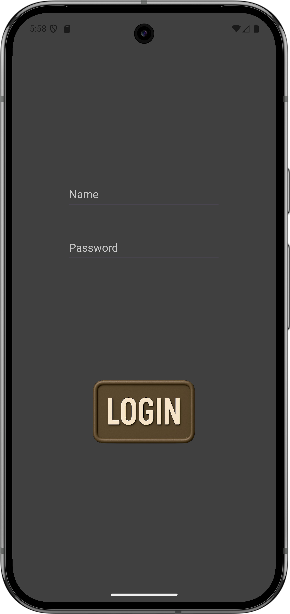
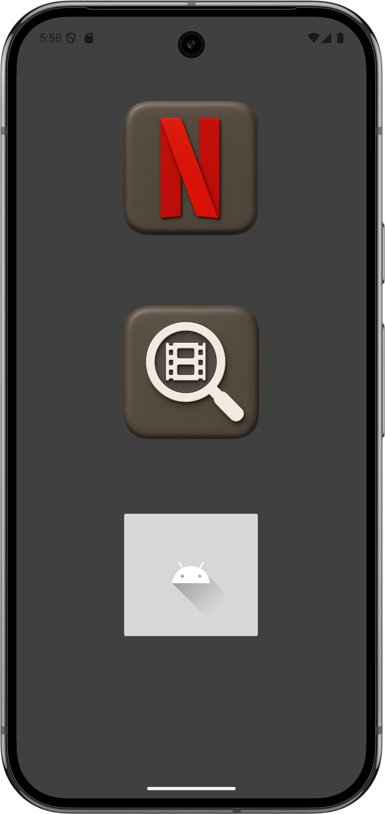
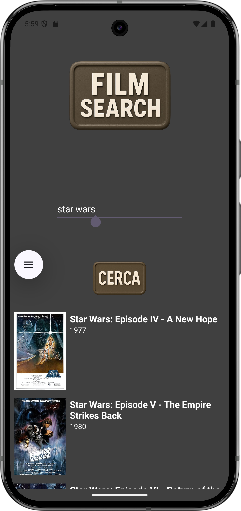

# 🎬 MyRestApp

---

Un'app Android che consente il login e offre funzionalità legate al mondo del cinema. L'app è progettata per API 35 e scritta in Kotlin.

---

## 📑 Indice:
1. 📋 [Caratteristiche Principali](#-caratteristiche-principali)
2. 🚀 [Installazione](#-installazione)
3. 🛠️ [Tecnologie Utilizzate](#-tecnologie-utilizzate)
4. 📱 [Guida all'Uso](#-guida-alluso)
5. 🖥️ [Requisiti Minimi](#-requisiti-minimi)
6. 👤 [Autore](#-autore)
7. 🖼️ [Schermate](#-schermate)
8. ⚠️ [Stato del Progetto](#-stato-del-progetto)

---

## 📋 Caratteristiche Principali:

- 🔐 Login con due utenti predefiniti:
  - 👤 **admin** / 🔑 **admin**
  - 👤 **utente** / 🔑 **utente**
- 🧭 Menù principale con tre opzioni:
  - 🎥 Pulsante che riporta al sito di **Netflix**
  - 🔍 Ricerca film per titolo
  - 📊 Accesso alla **Dashboard** (in sviluppo)
- 💡 Interfaccia utente semplice e intuitiva

---

## 🚀 Installazione

1. Clona il repository da GitHub:  
     ```bash
   git clone https://github.com/raffaeleGraz/MyRestApp.git
2. Apri il progetto in [**Android Studio**](https://developer.android.com/studio)
3. Collega un emulatore o un dispositivo Android
4. Premi ▶️ **"Run"** per avviare l'app

---

## 🛠️ Tecnologie Utilizzate

- 🧑‍💻 **Kotlin** – Linguaggio principale  
- 🧱 **XML** – Layout e UI  
- 🤖 **Android SDK API 35**  
- 🧰 **Android Studio** – IDE per sviluppo e testing  
- 📦 **Gradle** – Sistema di build

---

## 📱 Guida all'Uso

1. 📲 Avvia l'app  
2. 🔐 Effettua il login con uno dei profili disponibili  
3. 🧭 Accedi al menù principale e scegli:
   - 🎥 **Netflix**: ti reindirizza al sito ufficiale
   - 🔍 **Cerca Film**: inserisci un titolo per visualizzare i risultati corrispondenti
   - 📊 **Dashboard**: funzionalità in fase di sviluppo

---

## 🖥️ Requisiti Minimi

- 📱 **Sistema operativo:** Android 16 (API 35) o superiore  
- 🌐 **Connessione internet** per l'accesso a link esterni

---

## 👤 Autore

Creato con ❤️ da [Raffaele Graziani](https://github.com/raffaeleGraz)  
📧 Email: raffaelegraziani@risikamente.it  
🔗 GitHub: [@raffaeleGraz](https://github.com/raffaeleGraz)

---

## 🖼️ Schermate

<div style="display: flex; justify-content: space-between;">
  
  
  
</div>

---

## ⚠️ Stato del Progetto

🚧 Questo progetto è ancora in fase di sviluppo.  
Attualmente disponibili:
- ✅ Login funzionante
- ✅ Navigazione al sito Netflix
- ✅ Ricerca film
- 🔄 Dashboard non ancora completa
